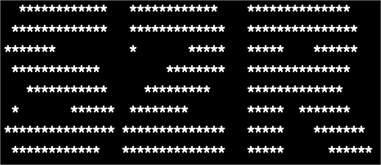

## **Goal: Zero migration of the decision model in the virtual scene to the real scene guarantees good adaptivity and stability.**

# run AMRL 
# install python=3.9
#pip install mlagents==0.29.0
#pip install torch gym numpy==1.20.3
4.使用cuda 10.2  pip3 install torch==1.8.1+cu102 torchvision==0.9.1+cu102 torchaudio===0.8.1 -f https://download.pytorch.org/whl/torch_stable.html

office train:
mlagents-learn "D:\RL_SR\Unity_office\ppo_carconavoid.yaml"  --env="D:\RL_SR\envs\test\car_seg_avoid.exe" --width=1000   --height=1000  --num-envs=1 --torch-device "cuda"  --time-scale=20 --run-id carconavoid1

deleate office run results , data is big, can not update

# 训练的数据存在台式电脑的RL_SR_DATA 中

