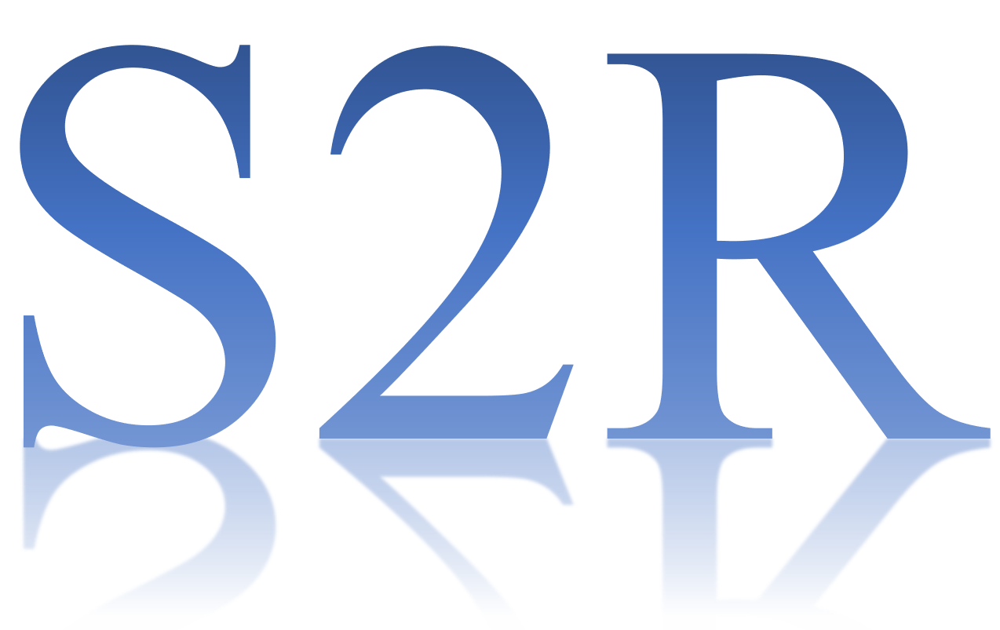

## **Goal: Zero migration of the decision model in the virtual scene to the real scene guarantees good adaptivity and stability.**

# Algorithm
1) AMDDPG
2) AMRL

# Requirement
1) python=3.9
2) mlagents==0.29.0
3) torch 
4) gym 
5) numpy==1.20.3
6) torch==1.8.1+cu102 torchvision==0.9.1+cu102 torchaudio===0.8.1 -f https://download.pytorch.org/whl/torch_stable.html

## License
[Apache License 2.0](LICENSE.md)

